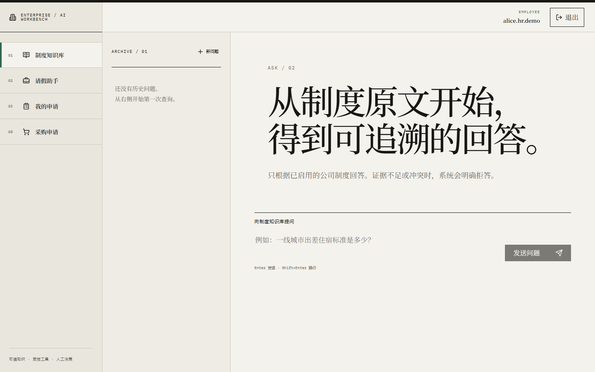
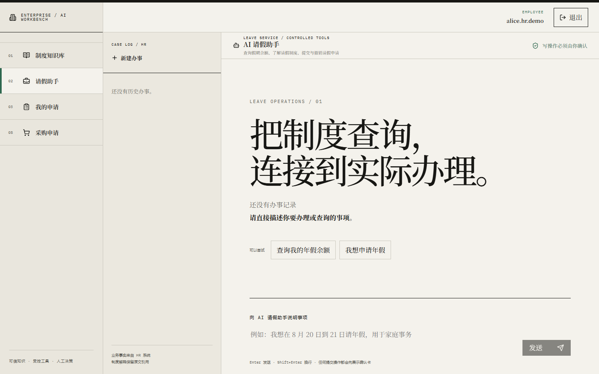
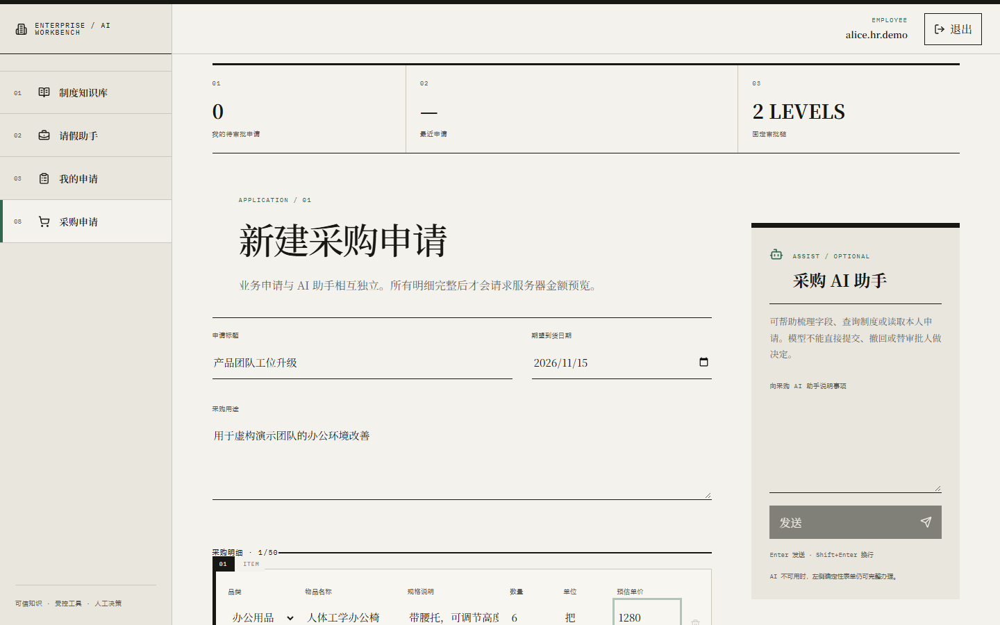
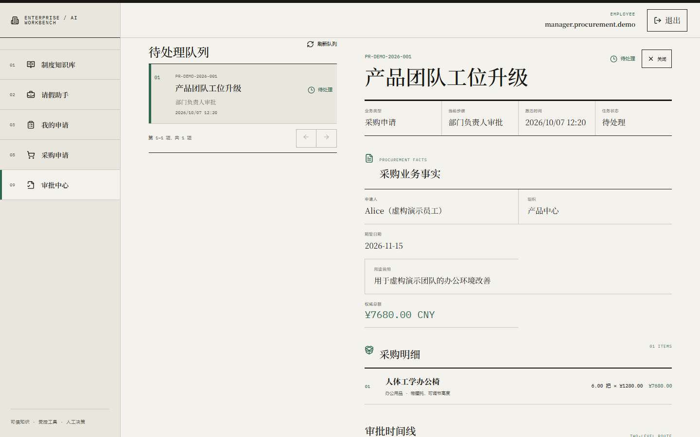
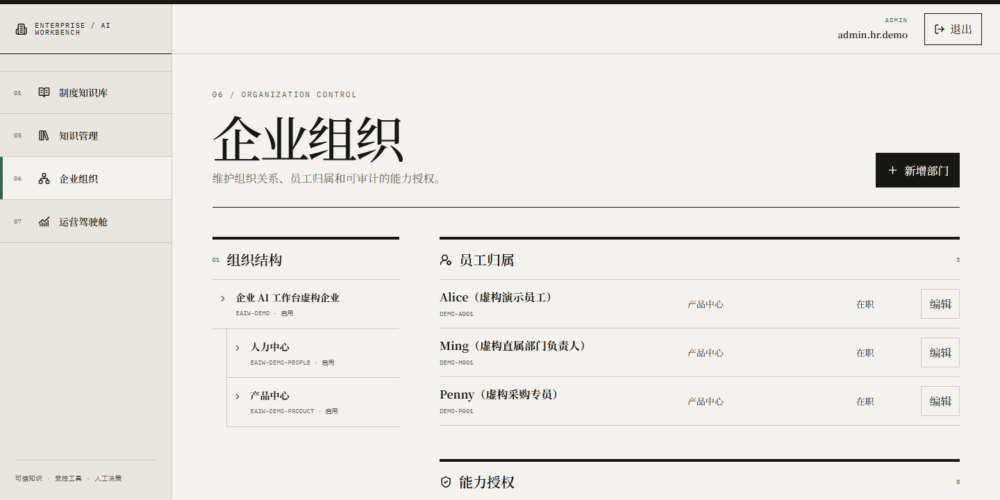
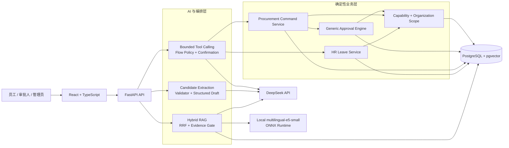

# Enterprise AI Workbench｜企业 AI 工作台

一个面向企业内部知识检索与流程办理的全栈 AI 应用。项目把企业知识问答、员工请假、采购申请、通用审批和组织权限放在同一工作台中，重点解决的不是“让模型直接做事”，而是如何把 LLM 的自然语言理解能力接入可验证、可审计、可回滚的确定性业务系统。

> 在线 Demo：[https://43-161-243-187.sslip.io/](https://43-161-243-187.sslip.io/)
>
> 技术栈：React · TypeScript · FastAPI · SQLAlchemy · PostgreSQL · pgvector · DeepSeek · multilingual-e5-small · Docker Compose
>
> 仓库定位：个人开发的工程作品，用于技术展示、学习交流与求职面试；当前未附加开源许可证。

## 为什么做这个项目

很多 AI Demo 停留在“输入一句话、输出一段文本”。企业场景还需要回答另外几个问题：

- 回答引用的制度是否真实存在、是否仍然有效？
- 模型从自然语言里提取出的日期、金额和枚举能否被业务系统信任？
- 模型提出写操作后，谁来确认、鉴权、保证幂等并写入数据库？
- 审批人在权限被撤销或并发操作发生时，系统能否保持单一终态？
- 真实模型存在非确定性时，质量如何被持续评测而不是凭感觉验收？

本项目采用统一原则：**LLM 负责理解、候选生成和自然语言交互；确定性程序负责业务事实、验证、权限和执行。**

## 功能展示

### 企业知识问答

- PDF、DOCX、TXT 上传与解析；
- 文本切片、本地 Embedding、pgvector 向量检索；
- 词法检索与向量检索融合，使用 RRF 排序；
- 证据资格判断、引用来源展示、冲突与无证据严格拒答；
- 文档启停、历史问答和管理员知识库管理。



### AI 请假助手

- 支持余额、时长、申请状态等只读工具；
- 支持年假和调休申请、撤销与显式 Confirmation；
- 结构化草稿保存已经验证的跨轮信息，用户只需补充缺失字段；
- owner scope、幂等、审计和事务边界由后端执行。



### AI 采购助手

- 自然语言和确定性表单共用同一采购提交服务；
- 标题、用途、到货日期和采购明细支持结构化草稿；
- 单个采购 item 按字段验证，明确值可以部分进入草稿，缺失值单独追问；
- 模型只能产生 proposal，不能直接创建采购申请。



### 通用审批中心

- 首个非 HR 流程为采购申请；
- 审批链：申请人提交 → 直属部门负责人审批 → 采购专员复核 → 完成；
- 任一步拒绝即终止；运行中允许申请人撤回；终态不可重新激活；
- 任务队列、审批详情、历史决策与组织权限统一展示。



### 组织与权限管理

- 用户、组织单元、任职关系、Capability Grant 与组织范围；
- 前端按权限展示入口，后端对每个读写请求执行权威校验；
- 审批写操作在事务内重新鉴权，不依赖页面打开时的旧状态。



## 系统架构



- Web 容器使用 unprivileged nginx 提供静态文件并反向代理 `/api`；
- FastAPI 提供认证、知识库、问答、HR、采购、审批和工作台 API；
- DeepSeek 是外部 OpenAI-compatible 模型服务；
- multilingual-e5-small 在独立本地容器运行，模型权重通过只读 bind mount 提供；
- PostgreSQL 保存业务数据、审计、草稿和 Embedding，pgvector 负责向量相似度检索；
- Docker Compose 管理 Web、API、Embedding 与数据库四个服务。

更完整的职责和信任边界见 [架构说明](docs/architecture.md)。

## 核心技术实现

### 1. Hybrid RAG：检索到内容不等于可以回答

问答链路同时生成词法候选和向量候选，再使用 Reciprocal Rank Fusion 合并。检索结果还需要经过证据资格判断：相关性不足、启用制度互相冲突或问题缺少必要业务参数时，系统分别进入严格拒答或澄清，而不是让 LLM 自行补齐事实。

最终回答携带引用快照；已停用文档不再支持新回答，但历史问答保留当时的证据。这样把“模型回答得像不像”拆成检索、证据、生成和引用四个可独立验证的环节。

### 2. LLM Candidate Extraction：开放语言理解，封闭业务写入

每个新的 client turn 最多进行一次结构化抽取。Extractor 只接收当前用户本轮原文和模块 Slot Schema，不读取助手回复、Tool 输出或其他会话来补造字段。

每个候选字段必须携带能在当前输入中找到的 `source_quote`。确定性 Validator 再执行：

- 字段白名单和来源验证；
- 日期、年份、金额、数量、枚举和范围规范化；
- 歧义判断以及 accepted / pending / rejected 分类；
- 与已验证历史草稿的冲突合并。

跨轮历史只来自已经验证并持久化的 Structured Draft。被拒绝的新候选不能覆盖历史可信值，模型也不能猜 unit、category、请假类型或年份。

### 3. Tool Calling：模型只能调用当前阶段允许的工具

通用 orchestrator 使用 3 次模型调用、4 次只读工具和 1 次写 proposal 的边界。领域 Flow Policy 根据当前阶段动态裁剪 Provider Schema，并在服务端再次校验本轮可调用工具；隐藏工具即使被模型返回也不会执行。

相同规范化参数的只读调用在单次运行内去重。写工具只产生 Confirmation proposal，不代表业务已经提交。用户确认后仍需经过权限、幂等、事务和领域校验。

### 4. 通用审批内核：流程状态与采购业务分离

采购请求和审批实例是不同聚合：

- `ProcurementRequest` 保存申请业务事实和 Items；
- `ApprovalInstance` 保存流程状态；
- `ApprovalTask` 保存当前审批任务；
- `ApprovalDecision` 保存不可变决策历史。

采购提交时 Request、Items、Instance 和 Tasks 在同一 PostgreSQL 事务中原子创建。`client_operation_id` 保护整个提交事务，而不是只保护单张表。审批和撤回使用行锁处理竞争，事务内重新读取权限和权威状态，保证拒绝、撤回和最终批准只能产生一个终态。

### 5. 权限不是前端按钮

前端菜单和按钮只是 UX。真正的安全边界在后端：角色授权、Capability、组织范围、owner scope 和资源状态共同决定访问结果。读查询尽量把组织范围下推 SQL；写操作不使用跨请求授权缓存，并在锁定业务行之后重新鉴权。

详见 [权限与安全设计](docs/security-and-permissions.md)。

## 测试与真实模型评测

以下结果来自不同时间、不同目的的数据集，不能合并成一个“综合准确率”。原始报告包含 Provider 和运行环境信息，因此没有直接复制到公开仓库；公开的是聚合指标、数据集合同和评分代码。

| 模块 | 数据集 / 阶段 | 结果摘要 |
|---|---|---|
| RAG 基线 | 49 条，33 train + 16 holdout | 回答正确率 89.80%，引用支持率 96.77%，正确拒答率 94.44%，E2E P95 5,338ms |
| RAG 具体业务问题 | corrected public 12 条 | 终态 12/12、引用 10/10；Retrieval P95 3,246ms **未达到 500ms 严格门槛**，E2E P95 4,918ms 达到 8,000ms |
| Candidate Extraction public | 60 条 | Field precision / recall 99/99，终态 60/60，Must-not-execute 60/60，Total-turn P95 1,835ms |
| Candidate Extraction seed-blind | 20 条，一次运行 | Field precision / recall 33/33，终态 20/20，Must-not-execute 20/20，Total-turn P95 1,849ms |
| HR Tool Calling public | 48 条，第 7 次公开回归 | 工具 48/48、完整参数 24/26、澄清 3/3、终态 48/48、Must-not-execute 33/33、P95 5,053ms |
| HR Tool Calling seed-blind | 20 条，一次运行 | 工具 19/20、完整参数 14/15、澄清 2/2、终态 20/20、Must-not-execute 14/14、P95 3,915ms |
| 采购 Tool Calling public | 20 条 | 工具 19/20、完整参数 14/15、澄清 2/2、终态 19/20、Must-not-execute 20/20、P95 2,952ms |
| 采购 Tool Calling seed-blind | 20 条，一次运行 | 工具 20/20、完整参数 15/15、澄清 2/2、终态 20/20、Must-not-execute 20/20、P95 2,684ms |

所有 Tool Calling 与 Extraction 评测均要求写执行、资源创建和重复资源为 0。seed-blind 数据集在代码冻结后生成，只运行一次；揭示后只能作为公开回归，不能再次宣称盲测。

RAG 的 Retrieval P95 是明确保留的性能债务：业务质量和端到端延迟可接受，不代表严格检索门禁已经通过。项目没有通过放宽阈值、修改分母或丢弃失败报告包装成功。

完整口径见 [评测说明](docs/evaluation.md)，代表性问题与修复见 [工程案例](docs/engineering-cases.md)。

## 本地部署

### 环境要求

- Docker Desktop 或 Docker Engine，支持 Docker Compose v2；
- 至少 8 GB 可用内存更适合完整四容器运行；
- DeepSeek 或其他 OpenAI-compatible Chat API；
- 本地 `intfloat/multilingual-e5-small` ONNX 模型文件；
- Windows PowerShell 7 或等价 shell。

### 1. 准备环境变量

```powershell
Copy-Item .env.example .env
```

编辑 `.env`，至少替换所有 `REQUIRED_*` 值。推荐用密码生成器生成独立的数据库密码、Session Secret 和演示账号密码。不要把 `.env` 提交到 Git。

`MODEL_DISABLE_THINKING` 是显式 Provider 能力开关，为保持 OpenAI-compatible 可移植性，它在生产配置中 defaults to `false`。仅当 Provider 是 DeepSeek，或明确支持相同 `thinking: {"type":"disabled"}` 扩展时设置 `MODEL_DISABLE_THINKING=true`；不要对未知兼容端点默认开启。

### 2. 准备本地 Embedding 模型

Windows 示例：

```powershell
powershell -File scripts/install_local_embedding_model.ps1 `
  -DownloadRoot "D:\model-cache\multilingual-e5-small\onnx" `
  -InstallRoot "D:\models\multilingual-e5-small\onnx"
```

然后在 `.env` 中设置：

```dotenv
LOCAL_MODEL_ROOT=D:/models/multilingual-e5-small
```

脚本会校验仓库中固定的 SHA-256。模型来自 `intfloat/multilingual-e5-small`，不随本仓库分发；使用前请自行核验上游模型卡和许可证。

### 3. 构建并启动

```powershell
docker compose config --quiet
docker compose up --build -d
docker compose ps
```

API 容器启动时会自动运行 `alembic upgrade head`。默认访问地址为 `http://localhost:8080/`。

### 4. 健康检查

```powershell
$env:WEB_PORT = "8080"
powershell -File scripts/verify_compose.ps1
```

也可以直接访问 `/api/v1/health/live` 和 `/api/v1/health/ready`。

### 5. 演示数据

仓库提供虚构制度和演示 seed。为避免密码进入命令历史，先把 `.env` 中的密码加载到当前终端环境，再只传变量名给容器。不要在生产数据库运行 demo seed。

```powershell
docker compose run --rm `
  -e DEMO_ADMIN_PASSWORD `
  -e DEMO_EMPLOYEE_PASSWORD `
  api python /app/scripts/seed_demo.py
```

完整 HR/采购组织演示数据使用 `/app/scripts/seed_hr_demo.py`。该脚本会校验数据库目标；只有明确传入 `--allow-non-test-demo-database` 才允许写入非 `_test` 数据库。使用前请确认当前 Compose 项目是独立本地环境。

### 6. 自动化验证

前端：

```powershell
Set-Location frontend
npm ci
npm test -- --run --no-file-parallelism --maxWorkers=1
npm run typecheck
npm run build
```

后端静态编译：

```powershell
python -m compileall -q backend/src backend/tests backend/scripts
```

后端单元测试：

```powershell
python -m venv .venv
.\.venv\Scripts\python -m pip install -e ".\backend[dev]"
.\.venv\Scripts\python -m pytest backend/tests/unit -q
```

真实 PostgreSQL 集成测试需要一个专门的、可丢弃的测试数据库，并通过 `DATABASE_URL` 指向它。不要把测试命令指向线上或个人业务数据库。部分真实模型评测还需要显式的 Provider 配置，会产生 API 费用；默认验证不运行这些评测。

### 常见问题

- `POSTGRES_PASSWORD is required`：`.env` 中仍有未替换的必填值；
- Embedding healthcheck 失败：检查 `LOCAL_MODEL_ROOT` 是否包含 `onnx/model.onnx` 等文件；
- API not ready：先检查 `db` 和 `embeddings` 的健康状态，再查看 API 日志；
- Windows bind mount 失败：确认 Docker Desktop 已允许访问模型所在磁盘；
- 端口占用：在 `.env` 修改 `WEB_PORT`，不要改变容器内 8080；
- 真实模型超时或 429：不会回退到伪造答案；请求按稳定错误码失败并保留幂等重试边界。

### 生产升级与文档停用说明

首次启用混合检索前，应先创建 PostgreSQL custom-format 备份，例如使用 `pg_dump -Fc`，记录备份大小与 SHA-256，并用 `pg_restore --list` 验证备份可读取。随后由数据库管理员执行：

```sql
CREATE EXTENSION IF NOT EXISTS vector;
CREATE EXTENSION IF NOT EXISTS pg_trgm;
```

应用数据库 owner 继续保持 `NOSUPERUSER NOCREATEDB NOCREATEROLE NOINHERIT`，不得授予安装扩展的管理员权限。扩展就绪后，再由普通应用 owner 执行 `alembic upgrade head`。不要把上述命令直接用于未经备份和变更审批的线上数据库。

制度文档停用必须复用现有可逆生命周期，而不是删除文件或新增第二套开关。管理员应先按显示名称找到候选，再核对 exact UUID、SHA-256、当前 `status` 和 `is_enabled`；任一字段变化就停止。确认后调用：

```text
POST /api/v1/documents/{document_id}/disable
POST /api/v1/documents/{document_id}/enable
```

disable 会设置 `is_enabled=false` 和 `DocumentStatus.DISABLED`，同时保留原文件、切片、摄取记录、历史引用和审计。Do not delete 数据库行、上传文件、source document、chunk、备份、容器或 volume。曾用于本地验收的发现提示包括 `真实DOCX格式验收.pdf`、`真实DOCX格式验收.docx`、`信息与版本说明.txt` 和 `火星出差管理办法（虚构演示）-录制A.txt`；它们只是名称提示，不能代替每个部署中的 UUID/SHA-256 核对，也不随本仓库发布。

## 项目结构

```text
.
├─ backend/
│  ├─ src/policy_api/       FastAPI、RAG、Tool Calling、HR、采购与审批
│  ├─ alembic/              PostgreSQL / pgvector 数据库迁移
│  ├─ evaluation/           真实模型评测数据集与 manifest
│  └─ tests/                单元、API、集成、权限与事务测试
├─ frontend/
│  └─ src/                  React 工作台、知识库、HR、采购、审批和管理端
├─ embedding-service/       本地 multilingual-e5-small ONNX 服务
├─ sample-data/             明确标注为虚构的制度与 RAG 评测数据
├─ scripts/                 seed、评测、Compose 验证和模型安装脚本
├─ docs/                    精选架构、工程案例、评测与权限说明
└─ compose.yaml             Web / API / Embedding / PostgreSQL 编排
```

## 已知限制

- 当前 HR 办事范围主要是年假与调休，不是完整 HRIS；
- 采购首期固定为两级审批，不包含财务审批、预算占用、付款和供应商主数据；
- DeepSeek 输出存在供应商侧非确定性，真实模型门禁只能降低风险，不能证明绝对确定；
- RAG 在当前 Windows/Docker/ONNX 环境存在冷态长尾，严格 Retrieval P95 仍是性能债务；
- Python 依赖目前使用版本范围而非 lock 文件，完全可复现构建仍有改进空间；
- 在线 Demo 使用虚构数据，访问权限、模型额度或可用性可能随演示环境调整；
- 本仓库未包含模型权重、真实业务数据、生产凭据或原始私有 Git 历史。

## 项目说明

这是个人独立开发项目，不代表真实企业内部系统或真实制度。项目使用外部 DeepSeek 模型服务和开源 Embedding 模型；所有公开样例组织、用户、制度、申请和评测案例均为虚构。

公开展示版本来源于私有开发仓库的稳定提交：

```text
2839d6a7d3c234d3d022f86661a2ff0d85f9a345
```

公开仓库使用新的、干净的 Git 历史，以避免携带本地开发资产和私有过程数据；它不是对原始开发历史的伪造或替代。
