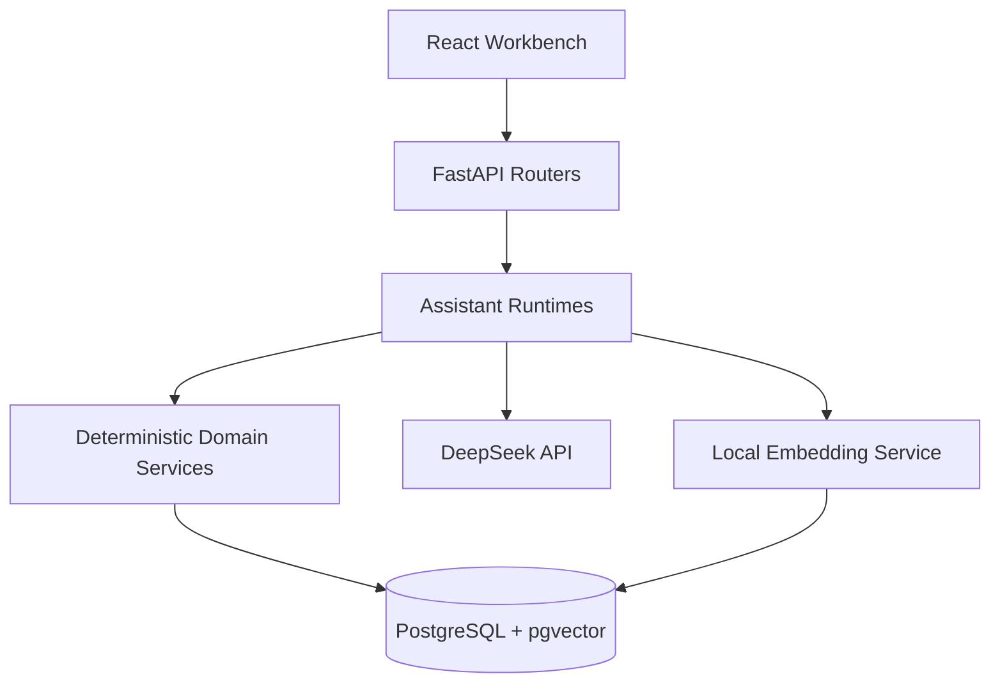
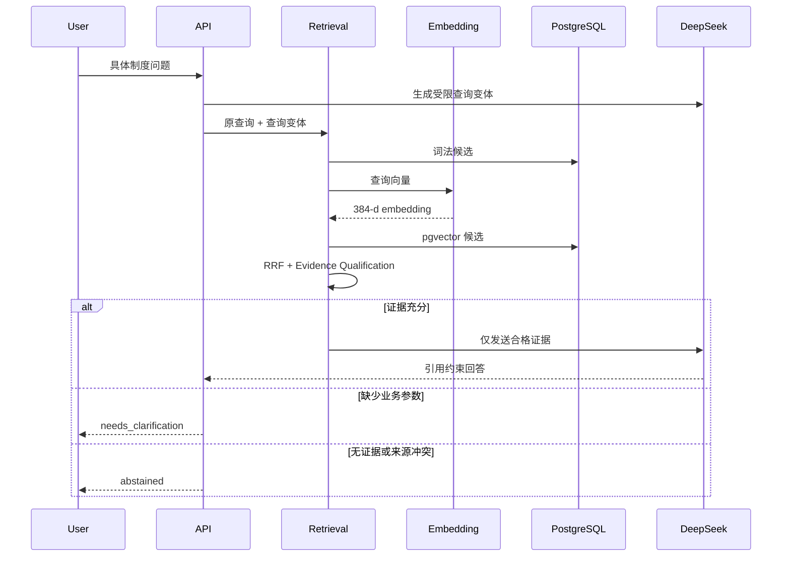
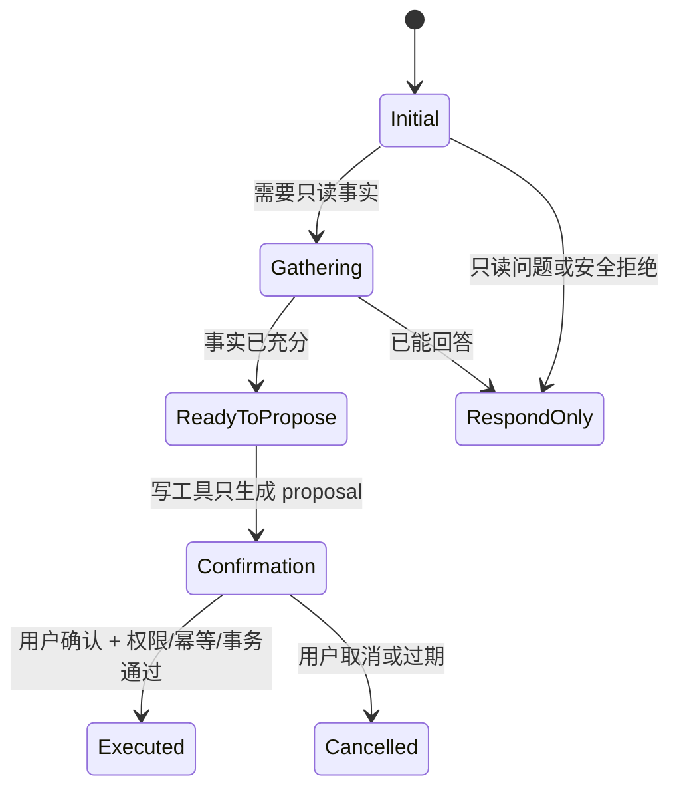

# 系统架构与模块边界

## 1. 设计目标

企业 AI 工作台不是多个独立 Demo 的集合。知识问答、请假和采购共享认证、组织、权限、审计、Tool Calling、Structured Draft 和可观测性基础设施；领域服务仍保持各自业务边界。

核心分层如下：



## 2. 运行组件

| 组件 | 责任 | 信任边界 |
|---|---|---|
| React Web | 路由、会话 UI、Confirmation 卡片、表单和管理页 | 不承担最终权限校验 |
| FastAPI | HTTP 合同、认证、CSRF、速率限制、领域编排 | 公开请求入口 |
| DeepSeek | 问答生成、Tool planning、Candidate Extraction | 输出始终视为不可信候选 |
| Embedding Service | multilingual-e5-small ONNX 推理 | 只读加载本地模型 |
| PostgreSQL + pgvector | 业务事实、草稿、审计、审批、向量 | 权威数据源 |

## 3. RAG 数据流



## 4. Candidate Extraction 与 Draft

Extractor 的输入只有当前 client turn 原文和模块 Slot Schema。模型返回 Candidate Envelope，每个字段包含 `raw_value` 与 `source_quote`。后端按字段执行来源验证和 canonicalization，再写入 Structured Draft。

```text
current user turn
  → candidate envelope
  → source verification
  → deterministic canonicalization
  → accepted / pending / rejected
  → draft merge
  → missing fields / proposal
```

历史消息本身不能补写业务字段。跨轮信息只能从已经验证并持久化的草稿读取。新候选失败时保留历史可信事实；显式修改已有字段时进入冲突处理，不静默覆盖。

## 5. Tool Calling 与 Confirmation

通用 orchestrator 不导入 HR 或采购枚举。领域 Flow Policy 负责意图、阶段和动态工具集合；Registry 先执行角色过滤，再与 policy 允许集合求交集。



预算固定为每次运行最多 3 次模型调用、4 次真实只读执行和 1 次写 proposal。相同工具与 canonical 参数只执行一次。Provider 返回未暴露工具、非法参数或无工具阶段的 Tool Call 时 fail closed。

## 6. 通用审批与采购边界

通用审批内核管理实例、任务、决策和状态迁移，不保存采购明细。采购领域保存标题、用途、期望日期、明细和金额。

采购提交的原子边界：

```text
client_operation_id
  └─ one PostgreSQL transaction
      ├─ ProcurementRequest
      ├─ ProcurementRequestItems
      ├─ ApprovalInstance
      └─ ApprovalTasks
```

任一步失败整笔回滚。相同 `client_operation_id` 重试返回已提交结果或稳定冲突，不会创建第二套业务资源。

采购首期审批链固定为直属部门负责人和采购专员两级。申请在实例仍为 running 时可撤回；任何拒绝直接终止；终态不可重新激活。

## 7. HR LeaveRequest 边界

HR 请假沿用自己的 `LeaveRequest`、余额预占和撤销规则，不迁入采购审批数据模型。它与采购共享的是工具编排、Confirmation、幂等、认证、审计和工作台体验，而不是强行共用同一领域表。

## 8. 部署边界

Compose 运行四个服务：`web`、`api`、`embeddings`、`db`。只有 Web 发布宿主端口；API、Embedding 和 PostgreSQL 保持 Compose 内部通信。模型权重通过只读挂载提供，数据库与上传使用独立 named volume。
